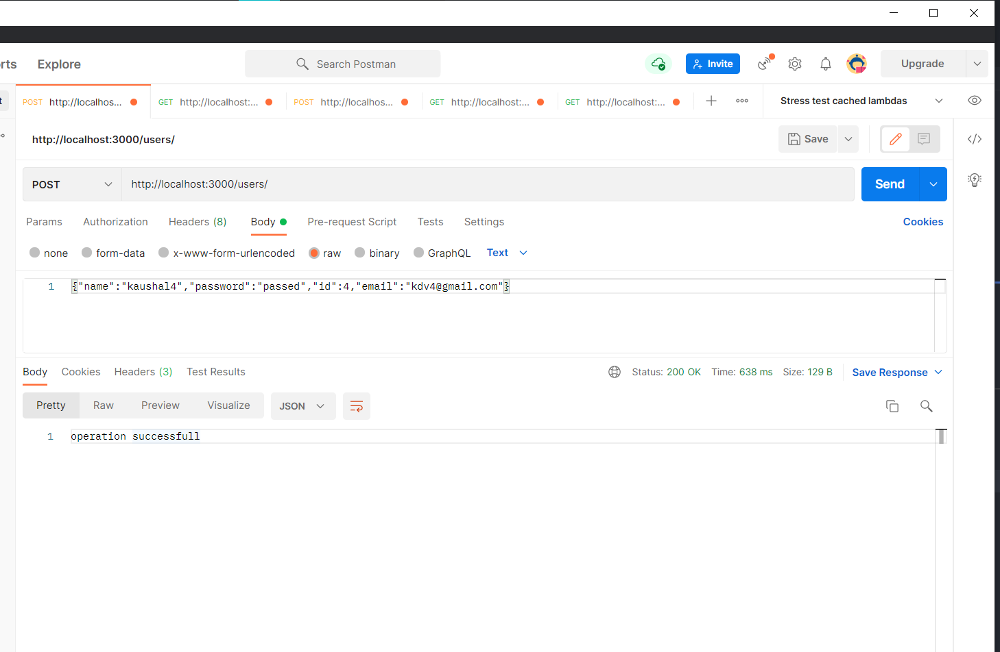

# Instagram API

## how to run

- install go in your device
- install mongodb and start mongod
- clone the repository
- execute `go run tidy` in root folder
- execute `go run` in root folder

## API endpoints and screenshots

- Create a User
  {:height="50%" width="50%"}
- Get a user using id
  
- Create a Post
  
- Get post using ID
  
- Get post using ID (pagination is implemented using offset=1)
  
- setting a different offset=2
  .png | width=250)
