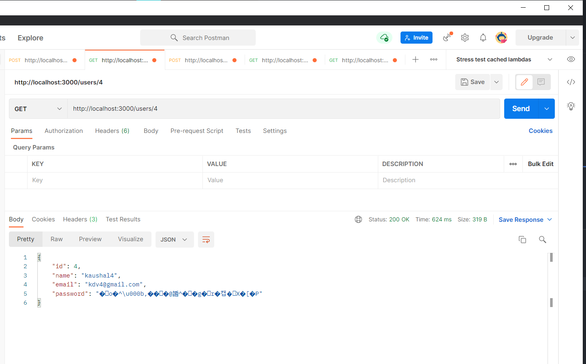

# Instagram API

## How to run

- Install go in your device
- Install mongodb and start mongod
- Clone the repository
- Execute `go run tidy` in root folder
- Execute `go run` in root folder
- Execute `go test ./... -cover` to run unit tests with coverage

## API documentation

#### create a user

- Should be a POST request
- Use JSON request body
- URL should be '/users'

#### Get a user using id

- This is a **GET** request
- Id is a url parameter
- URL is '/users/<id here>'

#### Create a Post

- This is a **POST** request
- JSON request body must be provided
- URL is '/posts'

#### Get a post using id

- It is a **GET** request
- Id is a url parameter
- URL is '/posts/<id here>'

#### List all posts of a user

- Should be a **GET** request
- Id is a url parameter
- Pagination Offset must be provided as JSON body
- URL should be '/posts/users/<Id here>'

## API endpoints and screenshots

- Create a User
  
- Get a user using id
  
- Create a Post
  
- Get post using ID
  
- Get post using ID (pagination is implemented using offset=1)
  
- setting a different offset=2
  .png>)

## Password Encryption

## Unit testing with overall coverage

